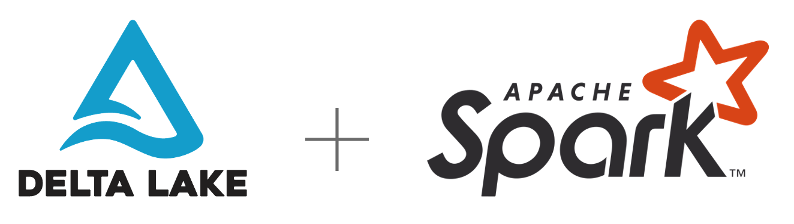
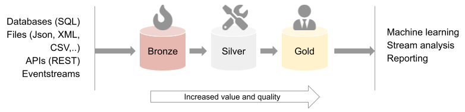

# Delta Lake

This demo shows a practical implementation of a Delta Lake using PySpark and a stream based architecture.

It is commonly recommendable to build a delta lake of three levels: bronze, silver and gold. Raw data are loaded into the bronze storage level with a minimum of modifications. At the silver level, data is loaded from bronze and altered by merging, filtering and cleaning the data. As data flows from bronze to the higher levels, the data quality and analytical relevance increase. At the gold level, data are ready for consumption. This can be as input data for training  machine learning models, real time event stream analysis or business level reporting.

This [blog article](https://blogg.kantega.no/delta-lake-arkitektur-datalagring-analyse/) goes more into depth on the topic of constructing a delta lake architecture and the big advantages it provides.

In this demo, we will start by constructing fictual raw data, inject it into bronze and load them into a silver level data storage. At the end, we will show how to revert operations and reach previous data versions.

1. [**Notebook - Generating example raw data**](/notebooks/generated_data/delta_demo/generate_raw.py) - Generating our example data (to be used in succeeding operations and notebooks).
1. [**Notebook - Injesting bronze data**](/notebooks/generated_data/delta_demo/bronze.py) - See how to injest data to the first bronze level.
1. [**Notebook - Constructing silver data**](/notebooks/generated_data/delta_demo/silver.py) - Construct stream pipeline for enriched data levels.
1. [**Notebook - Deleting data**](/notebooks/generated_data/delta_demo/delete.py) - See how Delta Lakes facilitate delete operations and allow you to remove specific entries across all data files.
1. [**Notebook - Time travel**](/notebooks/generated_data/delta_demo/time_travel.py) - Time traveling allow you to reach any historic versions of the data.
