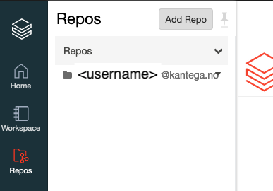
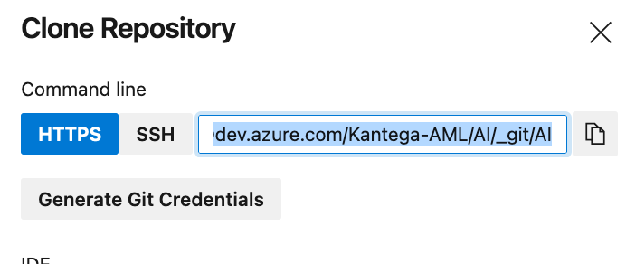
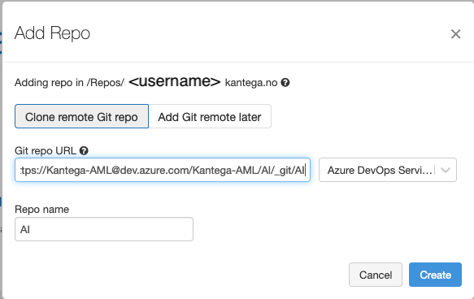

# Initial setup of Databricks Repos

Before you can start using GitHub repos, you first need to set it up for your Databricks user.

1. Add repo

    Find 'Repos' in the left sidebar, and then press 'Add repo'

    

2. Get Azure Repos URL

    Go to the repository, click 'clone', and copy the URL.

    

3. Enter the URL and create in Databricks

    Paste the copied URL, and press 'Create'

    
