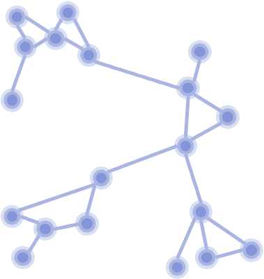
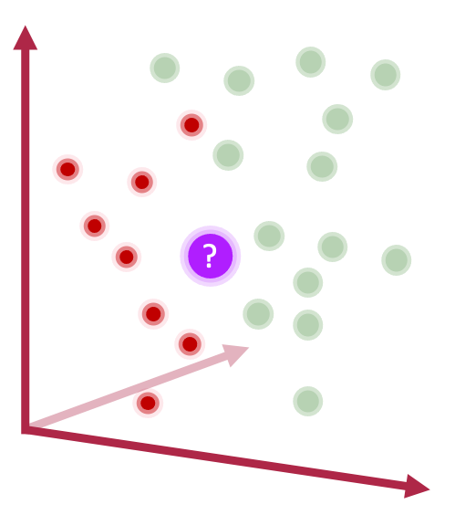
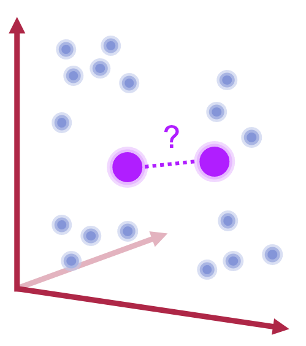
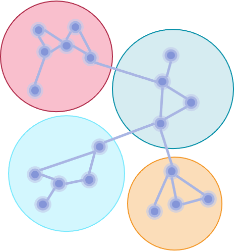

# Kantega AI

This project demonstrates multiple applied AI examples and how to operate on top of solid and highly scalable data platforms.

Overview:

- [Kantega AI](#kantega-ai)
  - [Graph Learning](#graph-learning)
    - [Introduction to Graph Structures](#introduction-to-graph-structures)
    - [Graph Neural Networks (GraphSage)](#graph-neural-networks-graphsage)
      - [Node classification / regression](#node-classification--regression)
      - [Link Prediction](#link-prediction)
    - [Community Detection](#community-detection)
  - [Visualization](#visualization)
    - [Shiny Apps](#shiny-apps)
  - [Machine Learning Methodologies](#machine-learning-methodologies)
    - [Active Learning](#active-learning)
  - [Data and Machine Learning Platform](#data-and-machine-learning-platform)
    - [Delta Lake](#delta-lake)
    - [MLFlow](#mlflow)

## Graph Learning

>"Graphs are networks of dots and lines."
*- Richard J. Trudeau*

Graph learning is one of the areas where machine learning has done most progress over the last years. In this field, machine learning is applied on graph data to model and understand node relationships and structural patterns. In the section below, we will show examples of techniques applied to identify the most influentian nodes and sub-communities in a graph, and how we can predict unseen properties and relationships.

### Introduction to Graph Structures

A graph 𝐺=(𝑉,𝐸) is a structure used to represent entities and their relations. It consists of two sets – the set of nodes 𝑉 and the set of edges 𝐸. An edge (𝑢,𝑣) ∈ 𝐸  connecting a pair of nodes 𝑢 and 𝑣 indicates that there is a relation between them. 

The relation can either be undirected, capturing symmetric relations between nodes (e.g. the friendship status in Facebook) or directed, capturing asymmetric relations (e.g. the follower system upon which Twitter is based). 
In the notebook tutorial below we provide show how to create and manipulate a graph object in Python by mean of the library _DGL_. Furthermore, we show how to append information to nodes and edges; these so called _features_ play a central role in the learning process typical of the machine learning models.

[**Notebook - Introduction to Graph Structures**](/notebooks/graph_models/demo_graph_structure.py)
* Environment: Python, DGL
* Dataset: FinCEN

### Graph Neural Networks (GraphSage)

<!--TODO: Short description and motivation-->

#### Node classification / regression

<!--TODO: Short description and motivation-->

tekst

<TODO: Notebook>

- Environment: Python, DGL
- Dataset: ?

#### Link Prediction

<!--TODO: Short description and motivation-->

tekst

### Community Detection

Community Detection is one of the fundamental problems in network analysis, where the goal is to find groups of nodes that are thightly related and more similar to each other than to the other nodes.
There are several approached for detecting communities within a larger graph structure. While some techniques traverse graph relations, others do more traditional clustering in an embedding space.

The notebook example below use Apache Spark to represent the FinCen Files dataset as a GraphX graph. Then, the Pagerank algorithm is used to score the significance and importance of each node (bank), before a label propagation algorithm is used to detect communities of highly connected banks.

[**Notebook - Community Detection**](/notebooks/graph_models/community_detection.py)

- Environment: PySpark
- Dataset: [FinCEN Files](https://www.icij.org/investigations/fincen-files/explore-the-fincen-files-data/)

## Visualization

<!--TODO: Short description and motivation-->

### Shiny Apps

Shiny is an R package that makes it easy to build interactive web apps straight from R. You can host standalone apps on a webpage or embed them in R Markdown documents or build dashboards.

In our notebook example, we use shiny apps to create an interactive visualization where users can explore historical earth quakes.

[**Notebook - Shiny Apps**](/notebooks/shiny/shiny_example.r)

- Environment: R
- Dataset: [Earth quake data](https://stat.ethz.ch/R-manual/R-devel/library/datasets/html/quakes.html)

## Machine Learning Methodologies

### Active Learning

Active learning is a special case of machine learning in which a learning algorithm can interactively query a user (or some other information source) to label new data points with the desired outputs.

Our notebook example shows how Active Learning allows you to train a high quality classifier model with a reduction of labeled training samples of 90% (in comparison to random sampling).

Active learning is very suitable for environments where machines and human experts work together as a team. The machines will improve their capabilities quickly and, over time, also adapt and detect new data patterns.
While they take care of the simpler cases, humans can spend their capacity on the challenging border cases where expert knowledge and wider experience are required.

[**Notebook - Active Learning**](/notebooks/elliptic/active_learning_elliptic_shap.py)

- Environment: Python
- Dataset: [Elliptic Dataset](https://www.kaggle.com/ellipticco/elliptic-data-set)

## Data and Machine Learning Platform

### Delta Lake
<!---TODO: Short description and motivation-->
<!---TODO: One md-file or notebook uniting the set of notebooks related to delta lake data flow-->

- Environment: Python, Delta Lake
- Dataset: ?

### MLFlow
<!---TODO: Short description and motivation-->
<!---TODO: One md-file or notebook uniting the set of notebooks related to MLFlow-->

- Environment: MLFlow, PySpark
- Dataset: ?
