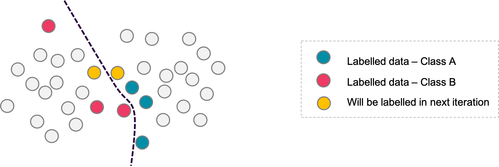
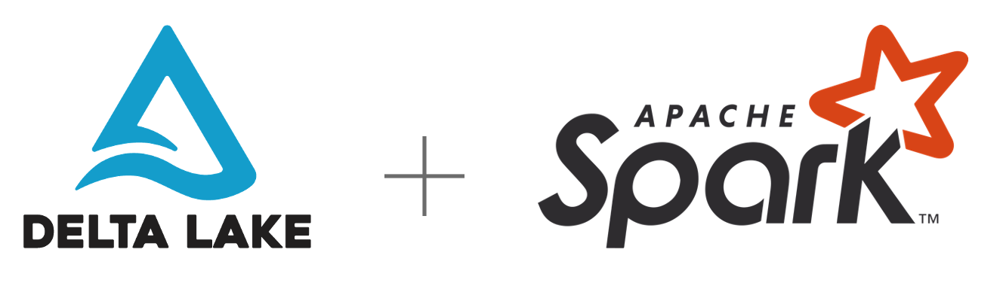

# Kantega AI

This project demonstrates multiple applied AI examples and how to operate on top of solid and highly scalable data platforms.

Overview:

- [Kantega AI](#kantega-ai)
  - [Graph Learning](#graph-learning)
    - [Introduction to Graph Structures](#introduction-to-graph-structures)
    - [Graph Neural Networks (GraphSAGE)](#graph-neural-networks-graphsage)
      - [Node classification / regression](#node-classification--regression)
      - [Link Prediction](#link-prediction)
    - [Community Detection](#community-detection)
  - [Visualization](#visualization)
    - [Shiny Apps](#shiny-apps)
  - [Machine Learning Methodologies](#machine-learning-methodologies)
    - [Active Learning](#active-learning)
  - [Data and Machine Learning Platform](#data-and-machine-learning-platform)
    - [Delta Lake](#delta-lake)
    - [MLFlow](#mlflow)
    - [PyCaret](#pycaret)

## Graph Learning

>"Graphs are networks of dots and lines."
*- Richard J. Trudeau*

Graph learning is one of the areas where machine learning has done most progress over the last years. In this field, machine learning is applied on graph data to model and understand node relationships and structural patterns. In the section below, we will show examples of techniques applied to identify the most influentian nodes and sub-communities in a graph, and how we can predict unseen properties and relationships.

### Introduction to Graph Structures

A graph 𝐺=(𝑉,𝐸) is a structure used to represent entities and their relations. It consists of two sets – the set of nodes 𝑉 and the set of edges 𝐸. An edge (𝑢,𝑣) ∈ 𝐸  connecting a pair of nodes 𝑢 and 𝑣 indicates that there is a relation between them.

The relation can either be undirected, capturing symmetric relations between nodes (e.g. the friendship status in Facebook) or directed, capturing asymmetric relations (e.g. the follower system upon which Twitter is based).
In the notebook tutorial below we provide show how to create and manipulate a graph object in Python by mean of the library _DGL_. Furthermore, we show how to append information to nodes and edges; these so called _features_ play a central role in the learning process typical of the machine learning models.

[**Notebook - Introduction to Graph Structures**](/notebooks/
fincen/graph_learning/demo_graph_structure.py)

- Environment: Python, DGL
- Dataset: FinCEN

### Graph Neural Networks (GraphSAGE)

Graph Neural Networks (GNNs) are deep learning based methods that operates on graph domain. Due to its convincing performance and high interpretability, GNN has been a widely applied graph analysis method recently ([ZHOU et al. 2018](https://arxiv.org/pdf/1812.08434.pdf) ). GNNs combine node/edge feature information with the graph structure by recursively passing neural messages along edges of the input graph.
These powerful methods allow to build models for performing fundamental ML tasks such  as node/edge classification and regression, link prediction and community detection. We shall investigate further the GraphSAGE model, a GNN suitable in several scenarios.

Relevant application areas

- GraphSAGE is particularly useful in environments where be have both graph structured data and additional metadata about the nodes and / or the edges.

[**Notebook - Introduction to GraphSAGE**](/docs/theory_docs/graphsage_theory.md)

#### Node classification / regression

Node classification with GNN (GraphSAGE) is a way to predict the category of a node in a graph. One of the most popular and widely adopted tasks on graph data is node classification, where a model needs to predict the ground truth category of each node. Before graph neural networks, many proposed methods are using either connectivity alone (such as DeepWalk or node2vec), or simple combinations of connectivity and the node’s own features. GNNs, by contrast, offers an opportunity to obtain node representations by combining the connectivity and features of a local neighborhood.
With the help of only a small portion of labeled nodes, a graph neural network (GNN) can with a good enough accuracy predict the node category of the others.

Relevant application areas

- **Examples**: Fraud and churn prediction

The notebook below does the following:

- Load a DGL-provided dataset.
- Build a GNN model with DGL-provided neural network modules.
- Train and evaluate a GNN model for node classification on CPU.

[**Notebook - Node Classification**](/notebooks/fincen/graph_learning/demo_node_classification.py)

- Environment: Python, DGL
- Dataset: FinCen
  
#### Link Prediction

Link prediction is used to predict the existence of a link between two nodes in a network. It can for instance be used to predict missing links due to incomplete data or, given a set of links at time _t_, it can be used to predict possible links at time _t + 1_. . Practical examples of link prediction can be “Songs you might like” in Spotify, “Friends you might know” in LinkedIn or recommender engines in online shops.

Relevant application areas

- Recommender systems are a typical usage case for link predication. Used to recommend ads, products or friends in social networks
- **Examples**: Pinterest and Uber Eats are two well knows services applying GraphSAGE implementations and link prediction in productions and part of the recommender services.

The notebook example below use Pytorch to predict the existence of edges in node pairs for the FinCEN Files dataset using Link prediction.

[**Notebook - Link Prediction**](/notebooks/fincen/graph_learning/demo_link_prediction.py)

- Environment: Python
- Dataset: [FinCEN Files](https://www.icij.org/investigations/fincen-files/explore-the-fincen-files-data/)

### Community Detection

Community Detection is one of the fundamental problems in network analysis, where the goal is to find groups of nodes that are thightly related and more similar to each other than to the other nodes.
There are several approached for detecting communities within a larger graph structure. While some techniques traverse graph relations, others do more traditional clustering in an embedding space.

Relevant application areas

- **Examples**: Anti money laundering (AML), Customer segmentation

The notebook example below use Apache Spark to represent the FinCen Files dataset as a GraphX graph. Then, the Pagerank algorithm is used to score the significance and importance of each node (bank), before a label propagation algorithm is used to detect communities of highly connected banks.

[**Notebook - Community Detection**](/notebooks/fincen/graph_learning/community_detection.py)

- Environment: PySpark
- Dataset: [FinCEN Files](https://www.icij.org/investigations/fincen-files/explore-the-fincen-files-data/)

## Visualization

<!--TODO: Short description and motivation-->

### Shiny Apps

Shiny is an R package that makes it easy to build interactive web apps straight from R. You can host standalone apps on a webpage or embed them in R Markdown documents or build dashboards.

Relevant application areas

- Can be used as a part of exploratory data analysis to understand the data at hand, and as a medium to communicate data findings with business level stakeholders.

In our notebook example, we use shiny apps to create an interactive visualization where users can explore historical earth quakes.

[**Notebook - Shiny Apps**](/notebooks/earthquake/shiny/shiny_example.r)

- Environment: R
- Dataset: [Earth quake data](https://stat.ethz.ch/R-manual/R-devel/library/datasets/html/quakes.html)

## Machine Learning Methodologies

### Active Learning

Active learning is a special case of machine learning in which a learning algorithm can interactively query a user (or some other information source) to label new data points with the desired outputs.

Relevant application areas

- Active learning: Any data environment where large volumes of labelled training data preexists, and where labelling og data is a time consuming and costly process.
- Also highly relevant in environments where the data is continuous and the machine learning models need to be adaptive and able understand new data patterns.
- **Examples**: Credit scoring, image and text classification, Fraud and spam detection

Our notebook example shows how Active Learning allows you to train a high quality classifier model with a reduction of labeled training samples of 90% (in comparison to random sampling).

Active learning is very suitable for environments where machines and human experts work together as a team. The machines will improve their capabilities quickly and, over time, also adapt and detect new data patterns.
While they take care of the simpler cases, humans can spend their capacity on the challenging border cases where expert knowledge and wider experience are required.

[**Notebook - Active Learning**](/notebooks/elliptic/active_learning/active_learning_elliptic_shap.py)

- Environment: Python
- Dataset: [Elliptic Dataset](https://www.kaggle.com/ellipticco/elliptic-data-set)

## Data and Machine Learning Platform

Sophisticated machine learning does not provide much value if the data it is trained on is of low quality. Also, you need a robust platform to operationalize machine learning professionally over time. In this section, we will introduce quality assuring data architectures and operational machine learning platforms.

### Delta Lake

Modern enterprise data landscapes, like Delta Lakes, incorporates data from both internal and external sources. They also handle extensive scalability requirements, and a wide span of data structures.

Relevant application areas

- Any environment with large data volumes. Delta lakes are especially useful when we have a mix of various data structures and data arriving as a continuous stream.
- **Examples**: Analysis of user interaction data,.. <!-- TODO: Mention one or two more super relevant application areas?? -->

Over a series of notebooks, we show how you can construct a Delta Lake in practice. We will take you from the steps of handling raw data to construct higher levels of quality and business value refinements. We will also show Delta Lakes support the ability to meet GRPR requirements for aonomymizing and deleting traces, and how you can do time travels to reach any past version of the data.

[**Notebooks - Delta Lake architecture**](delta_lake.md)

- Environment: Python, Delta Lake
- Dataset: Generated

### MLFlow

MLflow is an open source platform for managing the end-to-end machine learning lifecycle. It has the following primary components:

- Tracking: Allows you to track experiments to record and compare parameters and results.
- Models: Allow you to manage and deploy models from a variety of ML libraries to a variety of model serving and inference platforms.
- Projects: Allow you to package ML code in a reusable, reproducible form to share with other data scientists or transfer to production.
- Model Registry: Allows you to centralize a model store for managing models’ full lifecycle stage transitions: from staging to production, with capabilities for versioning and annotating.
- Model Serving: Allows you to host MLflow Models as REST endpoints.

Relevant application areas

- Any environment where machine learning models should be operationalised and maintained professionally over time.

In the Notebook example below, we are using the Elliptic data set, creating two different models, log their parameters and metrics (F1-score),
putting both in staging and finally one of them in production. At last it's shown how to score a test set using a registered model and a link
for serving a model using a REST API.

[**Notebook - MLflow**](/notebooks/elliptic/mlflow/model_registry.py)

- Environment: MLFlow, PySpark
- Dataset: Elliptic

### PyCaret

PyCaret is an open source, low-code machine learning library in Python that allows you to go from preparing your data to deploying your model. PyCaret interacts nicely with Mlflow, but there is no good interface for Spark Dataframes. As such, there is a scaling issue, but for many ML use cases PyCaret could serve as a great starting point. PyCaret is a huge time saver, in particual for preprocessing, but one should be aware that the default behaviour might be suitable for all datasets.

We have done some experimenting to assess the benefits and showcase the Mlflow work behind the scenes. We chose our "worst" dataset, since this requires missing value handling, encoding and handling of unknown labels. PyCaret handles this easily, though perhaps not optimally.

[**Notebook - PyCaret**](/notebooks/ieee_fraud/pycaret_experimentation.py)

- Environment: MLFlow, PySpark
- Dataset: IEEE Fraud
